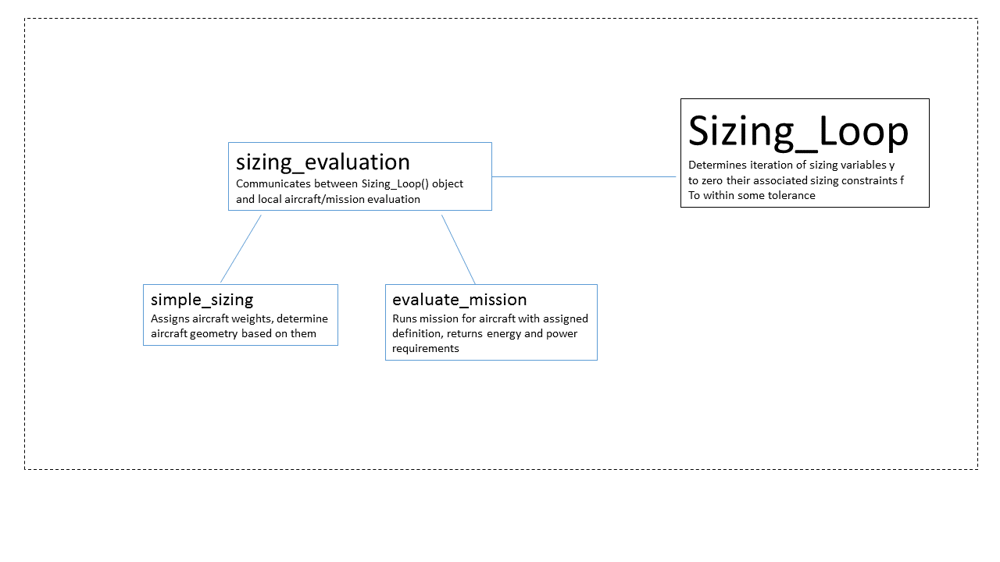

<link rel="stylesheet" href="//cdn.jsdelivr.net/highlight.js/8.6/styles/default.min.css">

## Introduction
The purpose of this tutorial is to highlight some of SUAVE's more exotic propulsion system capabilities, as well as the sizing methodology recently introduced

## Baseline Case
 Open the file called "Lithium_Air_Sizing/Sizing.py" in a text editor or IDE. Type "python Sizing.py" to run the file.

 Look over the plots, to gain a feel for the various idiosyncrasies of the design. Note the significant rise in aircraft mass, as a result of the lithium-air batteries, which accumulates oxygen as it discharges.

<pre><code class="python">
    battery = configs.base.energy_network['battery']
    battery.specific_energy=2000*Units.Wh/Units.kg
    battery.specific_power =.67*Units.kW/Units.kg
</code></pre>

Run the script (python tut_lithium_air_jet.py), and observe the plots. 

## Sizing Procedure
Now try changing the motor efficiency from .95 to .9 and running the script by going to Vehicle.py 

<pre><code class="python">
    net.nacelle_diameter  = ducted_fan.nacelle_diameter
    net.engine_length     = ducted_fan.engine_length    
    net.number_of_engines = ducted_fan.number_of_engines
    net.motor_efficiency  =.95
</code></pre>

Note the sensitivity of vehicle energy and mass requirements to these various propulsion system assumptions.

Now try changing the cruise range of the aircraft. Go to Mission.py, find the cruise segment, and change segment.distance

 
<pre><code class="python">
    segment = Segments.Cruise.Constant_Speed_Constant_Altitude()
    segment.tag = "cruise"
    
    segment.analyses.extend( analyses.cruise )
    
    segment.air_speed  = 230 * Units['m/s']
    segment.distance   = 2000 * Units.nautical_miles
    
</code></pre>

Try changing other parameters (e.g. specific power, cruise altitude), and observe their effects on the overall design.

Now look into how a an aircraft sizing problem is set up within SUAVE. A diagram of the process with a summary can be seen below, for reference

Go to the function "run_sizing_loop" within Sizing.py. The default initial guesses for your sizing parameters can be seen in the lines below

<pre><code class="python">
    #initial guesses
    m_guess    = 60000.       
    Ereq_guess = 100000000000.  
    Preq_guess=  200000. 
 
  
    scaling       = np.array([1E4,1E11,1E7])
    y             = np.array([m_guess, Ereq_guess, Preq_guess])/scaling
    min_y         = [.05, 1E-5,10.]
    max_y         = [10., 10., 10.]
    

</code></pre>

For a given aircraft, a numpy array we call "y" is used to define its set of sizing parameters. In this case, because it is a battery-powered aircraft, we iterate on aircraft total mass, battery energy, as well as battery power. Scaling is used to make the parameter guesses of order 1, as it makes some of the sizing methods more stable and robust. The default initial guess is then assigned to the sizing loop object, as seen below

<pre><code class="python">
    sizing_loop.tolerance                                      = 1E-4 #percentage difference in mass and energy between iterations
    sizing_loop.initial_step                                   = 'Default' #Default, Table, SVR
    sizing_loop.update_method                                  = 'successive_substitution' #'successive_substitution','newton-raphson', 'broyden'
    sizing_loop.default_y                                      = y
    sizing_loop.min_y                                          = min_y
    sizing_loop.max_y                                          = max_y
    sizing_loop.default_scaling                                = scaling
    sizing_loop.sizing_evaluation                              = sizing_evaluation
    

</code></pre>

In this case, only successive substitution is used to solve the problem, although that can be changed to newton-raphson or Broyden's method if the user chooses. Let's look at how the sizing loop works; it queries a function called "sizing_evaluation." Go to that script to see how it's set up.

<pre><code class="python">
def sizing_evaluation(y,nexus, scaling):

    #unpack inputs
    m_guess     = y[0]*scaling[0]
    Ereq_guess  = y[1]*scaling[1]
    Preq_guess  = y[2]*scaling[2]
</code></pre>-

How it works is it takes the initial guesses, unpacks them, then assigns them to the aircraft, as seen below

<pre><code class="python">
   #assign guesses to aircraft
    configs.base.m_guess = m_guess
    configs.base.Ereq    = Ereq_guess
    configs.base.Preq    = Preq_guess

</code></pre>

This function acts as an interface to allow communication between the Sizing_Loop object, which contains a number of methods to aid in evaluating the aircraft, with the specific aircraft observed here. It then calls the simple_sizing function, and evaluates the mission, as seen below.

<pre><code class="python">
    #run size aircraft geometry/mass based on guess
    simple_sizing(nexus)
    analyses.finalize()
    results = evaluate_mission(configs,mission)
    
</code></pre>

Now let's look at how they communicate. Go to the simple_sizing script within Sizing.py, and observe that it unpacks your mass, energy, and power scripts

<pre><code class="python">
    #unpack guesses
    m_guess = base.m_guess
    Ereq    = base.Ereq
    Preq    = base.Preq
</code></pre>

then assigns them to the aircraft

<pre><code class="python">
    base.mass_properties.max_takeoff   = m_guess
    base.mass_properties.max_zero_fuel = m_guess  #just used for weight calculation
    design_thrust                      = base.thrust_loading*m_guess*9.81 
    Sref                               = m_guess/base.wing_loading
    
    #assign area
    base.reference_area                     = Sref
    base.wings['main_wing'].areas.reference = base.reference_area
    
</code></pre>

It also uses the guess for battery and power to determine battery characteristics, as well as determine the takeoff weight.

<pre><code class="python">
    # battery calcs
    SUAVE.Methods.Power.Battery.Sizing.initialize_from_energy_and_power(battery,Ereq,Preq, max='soft')
    battery.current_energy = [battery.max_energy] #initialize list of current energy
    m_air                  =SUAVE.Methods.Power.Battery.Variable_Mass.find_total_mass_gain(battery)
    
    
</code></pre>

Remember that this is a lithium-air aircraft, so the difference in takeoff and landing weight is the oxygen accumulated during flight.

<pre><code class="python">
    #evaluate total mass breakdown
    breakdown                             = analyses.base.weights.evaluate()
    breakdown.battery                     = battery.mass_properties.mass
    breakdown.air                         = m_air
    base.mass_properties.breakdown        = breakdown
    base.mass_properties.operating_empty  = breakdown.empty 
    
    #m_full = GTOW, m_end = GLW
    m_full                       = breakdown.empty+battery.mass_properties.mass+breakdown.payload
    m_end                        = m_full+m_air
    base.mass_properties.takeoff = m_full
    
</code></pre>

Now go back to the sizing_evaluation in Sizing.py to observe how this framework handles outputs.

<pre><code class="python">
    # battery calcs
      
    mass_out = results.segments[-1].conditions.weights.total_mass[-1,0]  #actual landing weight
    Ereq_out = results.e_total
    Preq_out = results.Pmax
             
    #errors  
    dm       = (mass_out-m_guess)/m_guess
    dE_total = (Ereq_out-Ereq_guess)/Ereq_guess
    dPower   = (Preq_out-Preq_guess)/Preq_guess
    
    #pack up results
    nexus.results = results 
    
    # return it to sizing loop (within SUAVE/Sizing/Sizing_Loop.py
    f     = np.array([dm, dE_total, dPower])
    y_out = np.array([mass_out, Ereq_out, Preq_out ])/scaling
    
    
    
</code></pre>
It calculates the norm of the errors, then assigns them to an array f, and returns the expected y parameters to the Sizing_Loop object.