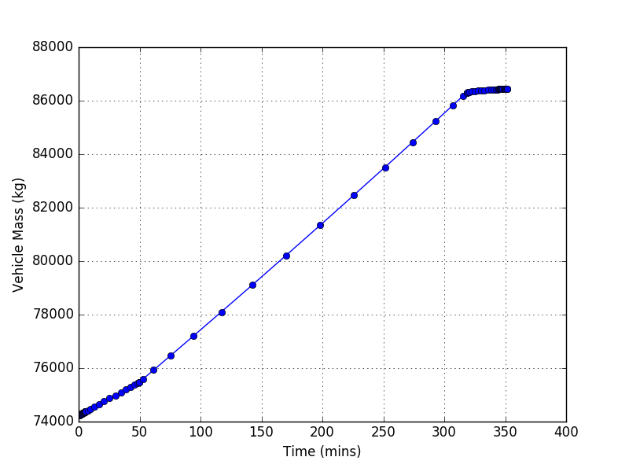

<link rel="stylesheet" href="//cdn.jsdelivr.net/highlight.js/8.6/styles/default.min.css">

##Introduction
The purpose of this tutorial is to highlight some of SUAVE's more exotic propulsion system capabilities. This tutorial assumes that the user has completed the Boeing 737-800 tutorial, and has some familiarity with SUAVE's propulsion system data structures.

##Baseline Case
 Open the file called "tut_lithium_air_jet_sizing.py" in 
a text editor or IDE.

 Run the program (cd to the folder, then type python tut_lithium_air_jet_sizing.py). 

 Look over the plots, to gain a feel for the various idiosyncrasies of the design. Note the significant rise in aircraft mass, as a result of the lithium-air batteries.

##Different Propulsion System Assumptions
Go to the following line (search battery.specific_energy), and change the battery specific energy from 2000 W-h/kg to 1500 W-h/kg
<pre><code class="python">
    battery = configs.base.energy_network['battery']
    battery.specific_energy=2000*Units.Wh/Units.kg
    battery.specific_power =.67*Units.kW/Units.kg
</code></pre>

run the script (python tut_lithium_air_jet.py).

Now try changing the motor efficiency from .95 to .9 and running the script (line 513).

<pre><code class="python">
    net.nacelle_diameter  = ducted_fan.nacelle_diameter
    net.engine_length     = ducted_fan.engine_length    
    net.number_of_engines = ducted_fan.number_of_engines
    net.motor_efficiency  =.95
</code></pre>

Note the sensitivity of vehicle energy and mass requirements to these various propulsion system assumptions.

Now try changing the cruise range of the aircraft (line 868, segment.distance).

 
<pre><code class="python">
    segment = Segments.Cruise.Constant_Speed_Constant_Altitude()
    segment.tag = "cruise"

    # connect vehicle configuration
    segment.analyses.extend( analyses.cruise )

    # segment attributes
    segment.atmosphere = atmosphere
    segment.planet     = planet

    segment.air_speed  = 230.
    segment.distance   = 1947. * Units.nmi

</code></pre>

Try changing other parameters (e.g. specific power, cruise altitude), and observe their effects on the overall design.